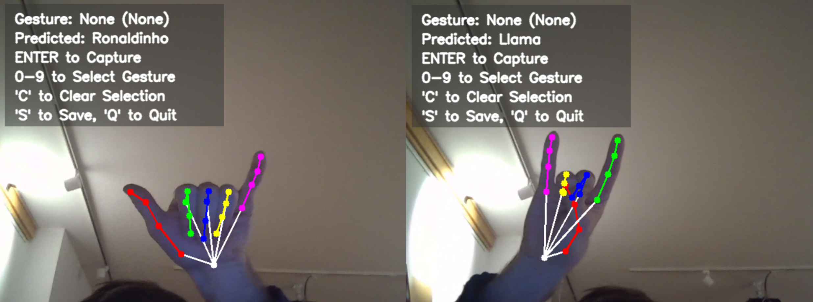

# Hand Gesture Recognition System

## Overview
This project implements a **real-time hand gesture recognition system** using **OpenCV**, **MediaPipe**, and **Keras**. The system detects hand landmarks, classifies gestures, and includes tools for training a custom gesture recognition model. It is designed to work with **both Windows and Raspberry Pi**, allowing users to train and deploy their own gesture models efficiently.

## Features
- **Live Hand Tracking** using MediaPipe's hand detection model  
- **Gesture Recognition** with a trained CNN model  
- **Gesture Recording** to collect training data  
- **Multi-Platform Camera Support** (Windows & Raspberry Pi)
  - Raspberry Pi not supported yet
- **Custom Model Training Pipeline** with Keras 

### 🚧 **Future Work**
- **Raspberry Pi Support**  
  While the system is designed to support Raspberry Pi, the necessary camera module is **not yet implemented**. Contributions are welcome!

## Installation
### Prerequisites
- Python 3.11
- OpenCV
- MediaPipe
- NumPy
- Pandas
- TensorFlow / Keras
- scikit-learn

### Install Dependencies
```bash
pip install -r requirements.txt
```

## Running the Gesture Recognition System
The system operates in two modes: **Training** and **Tracking**. The mode is selected in `main.py`.
It is also important to specify the `version_name` to let the system know which training set/model should be used.
The default is `version_name='generic_gestures'`. But if you make a new dataset, it may have a new name.

### **1. Running Gesture Tracking**
To start live hand tracking and gesture recognition, set `mode = Tracking` in `main.py`, then run:
```bash
python main.py
```
This initializes `HandTrackingApp`, which will open the camera and track a hand if on the screen.
Any data recorded will be stored in `hand_landmarks_data`.

### **2. Training a Custom Gesture Model**
To train the gesture recognition model using recorded CSV data, set `mode = 'Training'` in `main.py`, then run:
```bash
python main.py
```
This initializes `TrainModelApp`, which will train a model using the dataset stored in `hand_landmarks_data`.

## Configuration & File Paths
The system dynamically sets paths based on a `version_name`. The default structure is defined in `config.py`, and `main.py` formats these paths at runtime:

### **Dynamically Configured in `main.py`**
```python
version_name = 'example'  # <-- the current version name, multiple different modesl can be trained
```

## Camera Support
By default, the system uses the **Windows camera module**. To explicitly use it:
```python
from camera.windows_camera import WindowsCamera
camera = WindowsCamera()
```

If support for **Raspberry Pi** is needed, implement `raspberry_pi_camera.py` using the `BaseCamera` interface.
But it isn't implemented yet

## Screenshots
Below is an example screenshot of the hand tracking interface detecting hand landmarks in real time:




## Acknowledgments
- **MediaPipe Hands** for hand tracking
- **OpenCV** for computer vision processing
- **TensorFlow / Keras** for deep learning
